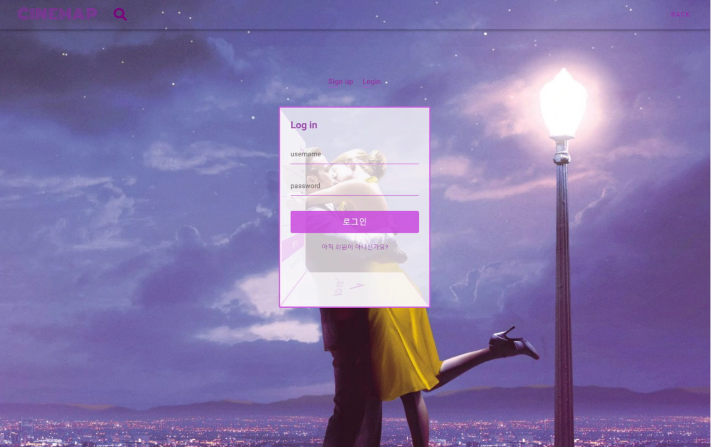

# FinalPJT

> Django REST Framework와 Vue.js를 활용한 영화 추천 및 커뮤니티 사이트
>

[toc]


# "CINEMAP"

> CINEMA🎞 + MAP🗺


## 개발 환경

### 1. 개발 스택

- Python
- Django
- HTML
- CSS
- SCSS
- JavaScript
- Vue.js
- Vuetify


### 2. 설치

+ python

```npm
python -m venv venv
source venv/Scripts/activate
python manage.py migrate
python manage.py runserver
```

+ vue

```
npm i
npm run serve
```


## 목표 설정

- 1등

- Django와 Vue를 모두 사용한 SPA 구현

- Scrum meeting 매일 2회


## 팀원

- 서울 3반 고은민

  - 데이터 수집
  - 프론트엔드 로직 구현
  - 페이지 디자인

  

- 서울 3반 이병승

  - 데이터 수집
  - 백엔드 API 서버 구현
  - 프론트엔드 로직 구현


## 서비스 구현 정도

- 영화로 떠나는 세계여행이라는 컨셉으로 세계 각지의 여행지 사진과 영화속 장면 사진들을 보며 마음에 드는 여행지를 배경으로 한 영화를 보거나 좋아하는 영화의 배경이 된 촬영지를 여행할 수 있도록 도와주는 서비스
  - 지도 위에서 핀을 클릭하면 여행지 사진과 영화 속 사진을 함께 보여줌
    - 상당 부분 구현했으나 데이터 부족으로 여행지 사진과 영과 속 장면 사진을 함께 보여주지는 못함
  - 데이터는 적더라도 대표적인 영화 위주로 디테일하게

- 캘린더에 그날 본 영화 사진을 추가해 나만의 영화 캘린더 구성
  - 클릭시 디테일 페이지
  - 마우스를 올리면 내용
  - 원하는 사진들을 추가하면 Carousel로 노출
    - 원하는 사진을 추가하거나 다수의 이미지를 Carousel로 보여주는 것이 아닌 단순히 영화 포스터 한 장을 보여주는 정도로만 구현
- 영화 추천 페이지에서 선택한 영화의 트레일러 영상 재생
  - Carousel 형태로 비슷한 다른 영화들의 트레일러 영화 재생 가능
  - 추가 버튼을 통해 선택한 영화와 비슷한 새로운 영화들의 트레일러 재생 가능
    - 완전히 구현
- 구글 로그인
  - 토큰을 vue로 전송하는 방법을 알지 못해 구현 실패


## 결과물

### Intro


- 서비스에 처음 접속하면 볼 수 있는 페이지로 start 버튼을 누르면 로그인한 유저의 경우 서비스 페이지로 이동하며 로그인하지 않은 유저의 경우 로그인 페이지로 이동


### Login



- 로그인과 회원가입을 한 페이지 안에서 할 수 있도록 구현하였으며 3d 큐브 애니메이션 추가


### Map


- 지도에서 핀을 클릭하면 해당 지역에서 촬영한 영화의 이미지를 Carousel로 출력
- 하단의 버튼을 누르거나 처음 페이지 진입시 팝업을 통해 맞춤 영화 추천


### Recommendations


- 추천받을 영화를 선택하면 해당 영화의 트레일러를 감상하거나 비슷한 다른 영화들의 트레일러를 감상할 수 있음
- 다른 영화를 선택하고 중앙의 Recommendations 버튼을 클릭하면 그 영화와 비슷한 영화들의 트레일러를 또다시 감상 가능


### Profile


- 자신의 프로필 페이지에서 프로필 사진과 소개글 등을 수정 가능
- 팔로우 목록에서 다른 유저의 프로필 이미지를 클릭하면 해당 유저의 프로필로 이동
- 영화 캘린더에서 원하는 날짜를 클릭시 새로운 리뷰를 작성하거나 그 날짜에 작성된 리뷰 확인 가능


### Create


- 새로운 리뷰 작성시 제목을 입력하면 자동 완성을 통해 영화를 선택 가능하며 영화를 선택하면 자동으로 포스터 이미지 출력


### Detail


- 리뷰 상세 정보 페이지에서 좋아요를 누르거나 댓글 작성 가능


### Review List


- 전체 리뷰 목록에서 좋아요, 댓글, 작성 시간 중 원하는 기준으로 정렬 가능


## Structure

### 1. ERD


- 대댓글(댓글의 댓글), 댓글 좋아요 구현하기
- 리뷰 테이블에 created_at 외에 watch_day를 추가해 영화를 본 날짜에 대한 정보 추가


### 2. Component


## Back end

### 0. 구조

- final_pjt
  - 프로젝트
- accounts
  - 계정 관련 앱
- movies
  - 영화 데이터 관련 앱
- reviews
  - 리뷰 관련 앱


### 1. 응답 데이터 구성

- accounts

  - 프로필 이미지의 경우 데이터를 받아오는 과정에서 문제가 자주 발생하고 다른 유저 정보와 비교해 자주 필요하기 때문에 Serializer를 따로 분리

  - 프로필 데이터를 응답할 때 프로필 페이지 구성을 위해 해당 유저가 작성한 리뷰 목록,  팔로잉 팔로워의 목록 및 수 그리고 팔로잉 팔로워 각각의 유저 이름과 프로필 이미지 데이터까지 포함

- movies

  - 영화 데이터의 경우 기본적으로 전체 영화 데이터를 응답하며 여기에 추천 영화 목록까지 포함
  - 추가 이미지를 가지고 지도에 표시할 영화 데이터의 경우 따로 분리해 Serializer를 구성

- reviews
  - 댓글과 리뷰 데이터 모두 유저 이름과 프로필 이미지 정보를 포함
  - 리뷰 데이터의 경우 디테일 페이지를 위한 하나의 리뷰를 응답하는 경우와 리뷰 목록을 위한 다수의 리뷰를 응답하는 경우로 구분
    - 하나의 리뷰를 응답하는 경우에 댓글 목록이 포함되며 다수의 리뷰를 응답하는 경우 댓글의 개수만 포함


### 2. TMDB API 데이터 받아오기

- 데이터를 받아와 바로 db에 저장하지 않고 일단 받아와서 전처리를 한 후에 영화 정보는 csv 파일로 저장하고 각각의 영화의 추천 영화 정보는 json 파일로 저장

  - 요청을 보내고 응답을 받아오는 함수를 따로 만들어 사용

    ```python
    def get_request(path, **kwargs):
        url = 'https://api.themoviedb.org/3'
        params = {
            'api_key':'7e70884f7539c7fbdc8e1f31d3f488cf',
            'language':'ko-KR'
        }
    
        params.update(kwargs)
    
        response = requests.get(url+path, params=params)
        data = response.json()
    
        return data
    ```

    

  - 포스터 이미지와 비디오의 경우 전체 데이터를 보내주는 것이 아니라 URI의 키 부분만 보내주기 때문에 앞 뒤로 필요한 내용을 붙여서 완성된 채로 저장

  - 최신순, 인기순, 평점순으로 5페이지 이내의 데이터들을 기준으로 비디오 키가 존재하는 경우에 저장하며 중복을 허용하지 않기 위해 `set()` 자료구조 활용

    ```python
    fields = ['id', 'title', 'poster_path', 'video_key']
    result_data = set()
    for path in ['now_playing', 'popular', 'top_rated']:
       for i in range(1, 6):
            movies = get_request(f'/movie/{path}', page=i).get('results')
            for movie in movies:
                id = movie['id']
                video = get_request(f'/movie/{id}/videos')
                if video.get('results'):
                    poster = 'https://image.tmdb.org/t/p/w500/' + movie['poster_path']
                    video = f"https://www.youtube.com/embed/{video['results'][0]['key']}?controls=1&rel=0&mute=1&autoplay=1&loop=1&playlist={video['results'][0]['key']}"
                    result = (id, movie['title'], poster, video)
                    result_data.add(result)
    ```

  - 추천 영화의 경우 비디오 데이터를 가지고 트레일러를 보여줘야 하기 때문에 목록에 있는지 확인하고 있는 경우만 데이터에 포함

  - 추천 영화 목록의 경우 carousel에 표시했을 때 7개가 넘어가면 지나치게 많은 정보가 표시되기 때문에 while문을 통해 7개의 영화가 모이면 종료되도록 설정

  - 영화 목록 자체가 적어 추천할 영화가 부족한 경우도 있기 때문에 추천 영화 및 유사한 영화 목록의 10페이지까지 탐색하면 종료되도록 설정

    ```python
    for id in id_col:
        i += 1
        print(round(i/len(id_col)*100, 2), '%')
        recom_list =  []
        page = 1
        while len(recom_list) < 7:
            results = get_request(f'/movie/{id}/recommendations', page=page).get('results')
            for result in results:
                if result['id'] in id_col and result['id'] not in recom_list and result['id'] != id:
                    recom_list.append(result['id'])
            page += 1
            if page > 10:
                break
    
        page = 1
        while len(recom_list) < 7:
            results = get_request(f'/movie/{id}/similar', page=page).get('results')
            for result in results:
                if result['id'] in id_col and result['id'] not in recom_list:
                    recom_list.append(result['id'])
            page += 1
            if page > 10:
                break
    
        recoms[id] = recom_list
    ```

    

### 3. 추천 알고리즘

1. 지역별 영화 사진을 보여주고 취향에 맞는 영화를 고를 수 있도록 추천

   - 일부 영화는 기본 포스터 이미지 이외에도 추가적인 이미지들을 가지고 세계지도 상에서 지역 별 영화들의 사진을 보고 유저가 마음에 드는 영화를 선택

2. 리뷰 데이터를 기반으로 영화 추천

   - 유저가 어떤 영화의 리뷰를 작성하며 평점을 주면 그 영화의 추천 영화 목록에 있는 영화들에게 평점만큼 점수 부여

   - 부여된 점수를 기준으로 상위 20개의 영화를 추천 목록으로 구성하고 팝업을 띄울 때 마다 목록에서 랜덤으로 영화 추천

   - 아직 리뷰를 작성하지 않아 추천할 영화가 없는 경우 전체 영화에서 랜덤으로 영화 추천

   ```python
   @api_view(['GET'])
   def recommendations(request):
       user = get_object_or_404(User, pk=request.user.pk)
       reviews = user.reviews.all()
       recom_list = {}
       for review in reviews:
           target = Movie.objects.get(title = review.movie_title)
           score = int(review.vote)
           recoms = target.recommendations.all()
           for recom in recoms:
               recom_list[recom.title] = recom_list.get(recom.title, 0) + score
       
       top20 = []
       for title, score in recom_list.items():
           if len(top20) < 20:
               top20.append(title)
           else:
               third = top20[-1]
               if recom_list[third] < recom_list[title]:
                   top20[-1] = title
           top20.sort(key=lambda x: recom_list[x], reverse=True)
       
       top20_data = []
       for title in top20:
           movie = Movie.objects.get(title = title)
           data = {
               'movieId': movie.movie_id,
               'title': movie.title,
               'posterPath': movie.poster_path,
           }
           top20_data.append(data)
       return Response(top20_data)
   ```

3. 영화 사진을 보고 선택하거나 팝업을 통해 추천받은 영화를 기준으로 또 다시 추천 목록을 보여주고 그 중에 다른 영화를 고르면 또 다시 그 영화를 기준으로 추천 영화를 보여줘 마음에 드는 영화를 고를 때 까지 탐색


### 4. 영화 달력 구성

- 리뷰 모델에 watch_day 필드를 추가해 그날 본 영화를 입력 가능
  - Front end 페이지에서 달력으로 구성해 출력


## Front end

### Intro Page

- 배경에 Carousel로 이미지가 넘어가도록 설정

  ```html
  <v-carousel
  hide-delimiters
  :show-arrows="false"
  class="carousel"
  height="110%"
  cycle
  :interval="5000">
    <v-carousel-item
  	src="https://www.themoviedb.org/t/p/original/nyuzfjAbuSel6dVKY4zFo95ugUf.jpg"
  	></v-carousel-item>
    <v-carousel-item
  	src="https://www.themoviedb.org/t/p/original/fspJGJP3NWBOz2Pm3EXvCvY44n3.jpg"
  	></v-carousel-item>
    <v-carousel-item
  	src="https://www.themoviedb.org/t/p/original/vqGEgGKD2zlISNlO8hTRz3ioIv8.jpg"
  	></v-carousel-item>
  </v-carousel>
  ```

  

- Start 버튼을 누르면 로그인 한 유저는 서비스 페이지로 이동하고 로그인 하지 않은 유저는 로그인 페이지로 이동

### Login/Signup Page

- 3D로 로그인 및 회원가입 창을 구성

- 한 페이지 내에서 로그인과 회원가입이 모두 가능하며 로그인에 성공한 경우 Thank you 메시지를 출력하고 페이지 이동

  

### Profile Page

- 프로필 사진 아래에서 다른 사람의 프로필인 경우 팔로우 기능 제공, 자신의 프로필인 경우 프로필 수정 기능 제공
- 팔로우와 팔로워의 수와 목록을 확인 가능하고 목록에서 다른 사람의 프로필 페이지로 이동 가능

- 달력의 날짜를 클릭해 리뷰를 작성하거나 작성된 리뷰의 상세 페이지로 이동


#### 문제 상황

- vuetify를 설치하는 과정에서 문제 발생

  - 태그를 통해 만드는 (`v-btn`, `v-card`, `v-calendar`등)들은 정상적으로 동작하나 내부에 속성으로 넣어주는 요소(`color=”primary”`, dialog 띄우기 등)은 적용이 안되는 문제
    
    - `App.vue`에서 최상위 태그를 `<v-app>`으로 감싸줘서 해결

- 달력을 `v-calendar`로 한번에 생성해 버려서 내부에 이미지 등 필요한 내용을 넣기 어려움

  - javascript 코드를 이용해 동적으로 달력을 생성

    ```js
    renderCalendar() {
      // 지난 달 마지막 Date, 이번 달 마지막 Date
      const prevLast = new Date(this.viewYear, this.viewMonth, 0)
      const thisLast = new Date(this.viewYear, this.viewMonth + 1, 0)
      const PLDate = prevLast.getDate()
      const PLDay = prevLast.getDay()
      const TLDate = thisLast.getDate()
      const TLDay = thisLast.getDay()
    
      // Dates 기본 배열들
      const prevDates = [];
      const thisDates = [...Array(TLDate + 1).keys()].slice(1)
      const nextDates = [];
    
      // prevDates 계산
      if (PLDay !== 6) {
        for (let i = 0; i < PLDay + 1; i++) {
          prevDates.unshift(PLDate - i)
        }
      }
    
      // nextDates 계산
      for (let i = 1; i < 7 - TLDay; i++) {
        nextDates.push(i)
      }
    
      // 동적으로 생성한 Dates를 data에 저장
      this.prevDates = prevDates
      this.thisDates = thisDates
      this.nextDates = nextDates
    ```

    

- 프로필 이미지를 저장하고 받아오는 과정 문제 발생

  - 먼저 이미지 파일을 입력 받아도 django 서버로 전송 자체가 되지 않는 상황
    - headers에 `'multipart/form-data'` 를 추가해 줘서 해결
    
    ```js
    updateProfile({ commit, getters }, profileData) {
      axios({
        url: drf.accounts.profile(profileData.username) + '/',
        method: 'post',
        data: profileData,
        headers: {
          ...getters.authHeader,
          'Content-Type': 'multipart/form-data',
        }
      })
        .then(res => {
        res.data.profile_image = drf.accounts.profileImage(res.data.profile_image)
        commit('SET_PROFILE', res.data)
      })
    },
    ```
    
    
    
  - 서버로 전송은 했으나 serializer에 저장이 잘 되지 않는 문제
    - 이전에 배운 대로 `request.FILES['profileImage']` 위치에 있는 파일 정보를 저장하려고 했는데 form을 사용할 때와 달리 저장이 되지 않아서 `image = request.data['profileImage']` data에 들어있는 파일 정보를 가져와 save하는 과정에서 `serializer.save(profile_image=image)`로 넣어줘서 해결
    
    ```js
    @api_view(['GET', 'POST'])
    def profile(request, username):
        user = get_object_or_404(User, username=username)
        def read_profile():
            serializer = ProfileSerializer(user)
            return Response(serializer.data)
        
        def update_profile():
            if request.user == user:
                image = request.data.get('profileImage')
                serializer = ProfileSerializer(user, data=request.data)
                if serializer.is_valid(raise_exception=True):
                    if image:
                        serializer.save(profile_image=image)
                    else:
                        serializer.save()
                    return Response(serializer.data)
            else:
                data = {
                    'error': '자신의 프로필만 수정할 수 있습니다.',
                }
                return Response(data, status=status.HTTP_401_UNAUTHORIZED)
    
        if request.method == 'GET':
            return read_profile()
        elif request.method == 'POST':
            return update_profile()
    ```
    
    
    
  - 마지막으로 이미지를 불러오는 과정에서 단순히 drf.js에 있는 HOST 주소에 받아온 url를 추가 해버리면 [`http://localhost:8000//media/profile_images/17ccba6c1b84f8bd6.jpeg`](http://localhost:8000/media/profile_images/17ccba6c1b84f8bd6.jpeg) 처럼 중간에 /가 두번 들어오는 문제발생

    - 따라서 `profileImageUrl.substr(1)` 로 받아온 url의 첫 번째 /를 삭제

  - 이 경우 프로필 이미지가 없으면 substr이라는 메서드가 undefined에 없어서 문제가 발생. 디폴트 이미지를 지정해 줬기 때문에 일반적인 경우라면 프로필 이미지가 항상 있어야 하지만 일단 개발 과정에서 지속적으로 문제가 생겼기 때문에 `profileImageUrl?.substr(1)`로 이미지 경로가 존재할 때만 적용되도록 변경

  - 마지막으로 프로필 이미지가 업데이트 될 때 두 가지 문제 발생 save버튼을 클릭한 뒤에 이미지가 갱신되지 않는다는 점과 프로필을 업데이트 하면 서버에서 보내주는 url에 HOST를 붙여주지 않았다는 점

    - save버튼의 경우 단순히 클릭하면 fetchProfile 함수를 한 번 더 호출하도록 해서 해결했는데 업데이트 할 때 url을 제대로 만들어 주지 않는 점은 어디서 문제가 발생했는지를 몰라 시간 소요

- 프로필 페이지들은 같은 라우터 경로를 가지고 있어 params를 변경해도 created가 실행되지 않는 문제

  - 한 사람의 프로필 페이지에서 다른 사람의 프로필 페이지로 넘어가도 페이지를 새로고침 할 때 까지 화면에 표시되는 내용이 갱신되지 않아서 라우터 경로를 이동하는 router link 태그가 아닌 버튼 태그를 만들어서 클릭하면 라우터 경로를 바꿔주면서 fetchProfile을 호출
  - updated를 사용하면 위의 프로필 이미지를 변경할 때나 params만 변경할 때 등 모든 경우에 쉽게 프로필 페이지를 갱신해 주지만 알 수 없는 이유로 updated를 사용하면 끝없이 요청을 보내서 사용 불가

- 프로필 페이지에서 프로필 이미지를 변경하면 프로필 페이지의 요소들에는 적용이 되나 다른 요소들에는 적용되지 않는 문제가 발생했으나 새로고침을 하면 모두 적용된다는 점을 이용해 프로필 이미지를 업데이트 하는 경우 새로고침을 하도록 하는 코드 추가

  ```js
  updateProfileImage() {
    this.dialog = false
    this.$router.go()
  },
  ```

  

### Map Page

- 처음 페이지에 들어가면 추천 영화 팝업

  ```js
  methods: {
    ...
    getRecommend() {
      this.selected = this.selectRecommendMovie()
      this.isActive = true
      this.timer1 = setTimeout(() => {
        this.isActive = false
      }, 10000)
      this.timer2 = setTimeout(() => {
        this.isActive = false
      }, 10000);
    ...
    },
  
  created() {
    this.getMapMovies()
    this.fetchMovies()
    this.getUserRecommendations()
    setTimeout(() => {
      this.getRecommend()
    }, 900)
  },

- 달력의 핀을 클릭하면 Carousel 이미지를 보여주고 마음에 들면 이미지를 클릭해 추천 페이지로 이동

- 마음에 드는 이미지가 없다면 하단의 버튼을 클릭해 추천 알고리즘으로 추천된 영화를 팝업창으로 확인하고 마찬가지로 포스터 이미지를 클릭해 추천 페이지로 이동


### Recommendation Page

- 선택한 영화의 트레일러 재생
- Carousel을 통해 해당 영화와 유사한 영화 추천
- 추천된 영화 중 하나를 선택하면 그 영화와 유사한 영화를 추천


### ReviewComment Page

- 리뷰의 작성 수정 삭제가 모두 가능

- 댓글의 작성 수정 삭제가 모두 가능

- 전체 리뷰 목록에서 좋아요, 댓글, 작성 시간을 기준으로 정렬 가능

  ```js
  // ReviewListView.vue
  data: () => ({
    sortedByLikes: true,
    sortedByComments: false,
    sortedByDate: false,
  }),
  methods: {
    ...mapActions(['fetchReviews', 'sortReviewsByLikes', 'sortReviewsByComments', 'sortReviewsByDate', ]),
    getSortedByLikes() {
      this.sortReviewsByLikes()
      this.sortedByLikes = true
      this.sortedByComments= false
      this.sortedByDate= false
    },
    getSortedByComments() {
      this.sortReviewsByComments()
      this.sortedByLikes = false
      this.sortedByComments= true
      this.sortedByDate= false
    },
    getSortedByDate() {
      this.sortReviewsByDate()
      this.sortedByLikes = false
      this.sortedByComments= false
      this.sortedByDate= true
    },
  }
  
  
  // review.js
  mutations: {
    ...
    SORT_REVIEWS_BY_LIKES: (state) => state.sortedReviews = state.reviews.sort((a, b) => b.review_likes_count - a.review_likes_count),
    SORT_REVIEWS_BY_COMMENTS: (state) => state.sortedReviews = state.reviews.sort((a, b) => b.review_comments_count - a.review_comments_count),
    SORT_REVIEWS_BY_DATE: (state) => state.sortedReviews = state.reviews.sort((a, b) => a.updated_at > b.updated_at ? -1 : 1),
    ...
  }
  ```


## Admin


# 느낀점


## 고은민

우선 배우기만 했던 내용을 실제 구현해보는 데서 희열을 느꼈고, 많은 에러를 마주하고 삽질도 했지만 그 과정이 있었기에 많이 배울 수 있었다고 생각한다. 처음에 UI 기획할 때 구현 하고 싶었던 것들이  많았는데 1주일 정도 짧은 시간 제약으로 다 구현하지 못해서 아쉬움이 많이 남는다. 프로젝트 발표 후에 조금만 쉬고 다시  리팩토링 하면서 구현해보고 배포까지 완성해보고 싶다. 

수면 시간을 줄여가며 개발한 경험이 처음이라 나중에도 기억에 많이 남을 시간이었다. 특히 같이 팀으로 함께한 병승오빠 덕분에 끝까지 할 수 있었다. 잠도 별로 못자고 예민할 수도 있지만 한 번도 트러블 없이 서로 챙겨주면서 힘들지만 재미있게 개발할 수 있었다. 정말 좋은 팀워크였다! 


## 이병승

각각의 생각보다 시간이 많이 걸려서 구현하고 싶었던 서비스를 모두 구현하지 못해 아쉬웠다. 갈수록 코드가 복잡해지면서 작은 부분 하나를 고쳐도 오류가 잔뜩 발생하고 특히 비동기로 요청을 보내고 받아오려고 하면 분명 좀 전에는 있던 변수가 자꾸 `undefined`라면서 오류가 발생하곤 했다.

그래도 함께한 은민이와 마음이 잘 맞아서 갈등을 겪을 일이 없고 서로 부족한 부분을 채워 줘 가면서 프로젝트를 재밌게 진행할 수 있었다. 프로젝트 결과물은 전반적으로 보완이 필요하다고 생각이 들어 아쉽지만 팀워크 만큼은 만족스러웠다.